# Reachy Mini Lite × Strands Agent — local-first voice & vision robot

A **[Reachy Mini Lite](https://huggingface.co/docs/reachy_mini)** desk robot driven
by a **[Strands](https://strandsagents.com/)** agent that runs **entirely on-device**
on an **NVIDIA Jetson Thor**. Say *"Hey Reachy"* (or publish an MQTT message) and a
fresh agent wakes up, decides which tool it needs — **see** the room with a local
vision model, **express** an emotion with a pre-choreographed move, or **answer**
questions about IoT sensor data in an AWS data lake — speaks one short sentence, and
tears itself down. Idle is pure-local and **$0**: no cloud, no LLM tokens, just an
offline wake-word listener.

> This is the `localllm` branch: the agent's brain defaults to a **local Nemotron
> model via Ollama** ($0, offline) and the eyes are **NVIDIA Cosmos Reason 2**
> running locally on the Thor GPU. Amazon Bedrock (Nova 2 Lite) remains an opt-in
> backend for the exact same agent and tools.

## System architecture

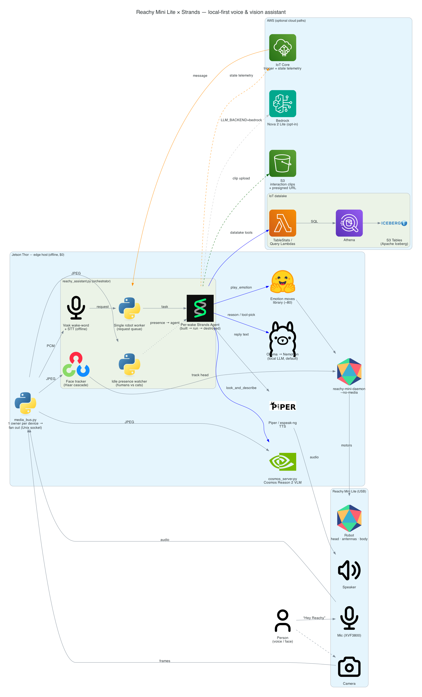

Everything in the blue box runs on the Jetson Thor with no network dependency. The
robot is connected over **USB** and exposes its motors, camera, mic, and speaker
through the `reachy-mini-daemon` (started with `--no-media` so the **media bus**
brokers can own the camera and mic and fan them out to every consumer — see
[feature 16](#16-cameramic-media-bus)).

Two trigger sources feed a **single request queue**, and one worker thread drains it
so the motors and the agent are never driven by two sources at once:

1. **Voice** — an offline [Vosk](https://alphacephei.com/vosk/) recognizer listens
   for the wake word. On a match the head raises ("I'm listening"), the request is
   transcribed offline, and a fresh Strands agent runs it.
2. **MQTT** — an optional AWS IoT Core subscription (WebSocket + SigV4, no certs).
   Each message is turned into a request and fed to the same agent task.

While idle, two more local loops run concurrently and **never** touch the cloud:
a **face tracker** (OpenCV Haar cascade) that keeps the head pointed at you, and an
**idle presence watcher** that periodically asks Cosmos who it sees and routes the
observation through **species-specific Strands tools** (humans vs cats).

The camera and mic are single-opener devices, so a small **media bus** (`media_bus.py`)
runs one broker per device and fans the live streams out over Unix sockets — the
face tracker, idle watcher, clip recorder, voice loop, and any *new* process can all
read the same camera and mic at once. When MQTT is configured, every agent action also
**uploads a full robot-state snapshot** to AWS IoT Core, and each interaction is
**recorded to a clip, stored in S3**, and linked from the reply message — all
non-blocking and a no-op when the cloud paths are off.

### The agent per-wake lifecycle

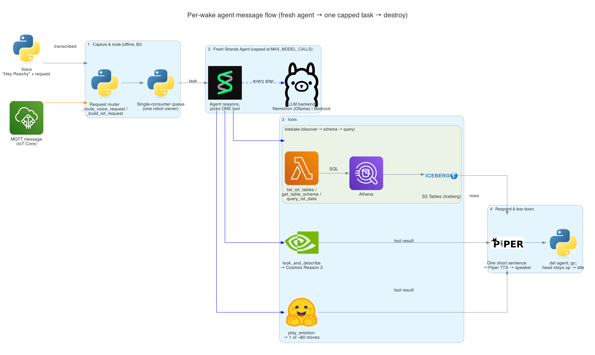

Each wake builds a **brand-new agent**, runs it under a hard model-call cap, and
destroys it — so there is no long-lived LLM process burning resources (or cost)
between interactions.

## Edge platform

| Component | Detail |
|-----------|--------|
| Compute | **NVIDIA Jetson Thor** (CUDA GPU, unified memory) |
| Local LLM | **Nemotron** (`nemotron-3-nano:30b`) served by **Ollama**, function-calling enabled |
| Local VLM | **NVIDIA Cosmos Reason 2** (`nvidia/Cosmos-Reason2-2B`, a Qwen3-VL model) |
| Wake word / STT | **Vosk** small English model (offline) |
| TTS | **Piper** (offline neural voice), falling back to `espeak-ng` |
| Robot | **Reachy Mini Lite** over USB (head 6-DoF, antennas, body, camera, mic, speaker) |

The heavy CUDA stack lives in a dedicated `.venv-cosmos`; the assistant venv (`.venv`)
holds the lighter SDK + Vosk + Strands + Piper deps. They share one code path for
Cosmos via `cosmos_describe.py`.

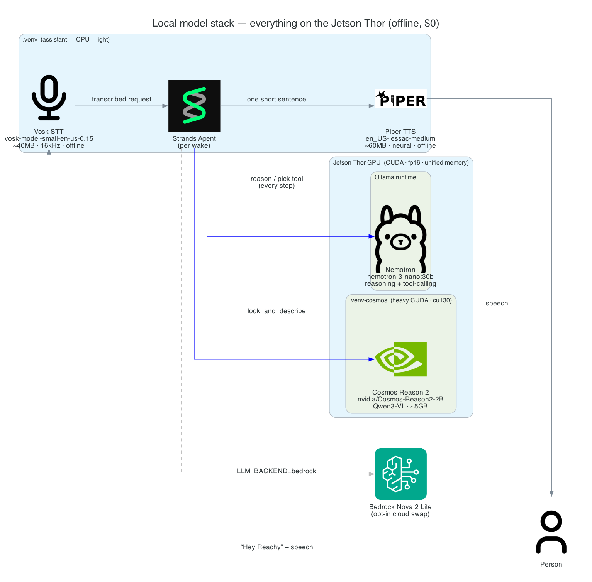

> **See [`docs/local-models.md`](docs/local-models.md)** for a detailed breakdown of
> every local model — Nemotron, Cosmos Reason 2, Vosk, and Piper: how each is loaded,
> invoked, and configured, the Jetson-specific gotchas, and the local-vs-Bedrock swap.

## AWS services (optional cloud paths)

All of these are opt-in — the assistant runs fully offline without them.

| Service | Role |
|---------|------|
| **IoT Core** | Second wake source **and** telemetry sink. Subscribes to a trigger topic over WebSocket + SigV4 (default AWS credential chain — no device certs), and reuses the *same* connection to **publish** a full robot-state snapshot on every action ([feature 14](#14-robot-state-telemetry-to-iot-core)). |
| **S3** | Stores the **interaction video clips** ([feature 15](#15-interaction-clip-recording--s3)); the reply message carries a presigned download URL. Set `S3_BUCKET` to your own bucket. |
| **Lambda** | Two functions (resolved from a CloudFormation stack) that front the data lake: table stats and parameterized queries. |
| **Athena** | Runs the SQL the Query Lambda issues against the lake. |
| **S3 Tables / Apache Iceberg** | The IoT sensor data lake the agent queries (`list_iot_tables` → `get_table_schema` → `query_iot_data`). |
| **Bedrock** | Optional agent backend (`LLM_BACKEND=bedrock`, Amazon Nova 2 Lite) in place of local Nemotron. |

## Prerequisites

- **Reachy Mini Lite** assembled and connected over **USB**, power supply on (motors).
- **NVIDIA Jetson Thor** (or another CUDA box) for the local LLM + VLM. CUDA is
  required — `cosmos_describe.py` aborts if `torch.cuda.is_available()` is false.
- **One-time host setup** (see [Host setup & hardware notes](#host-setup--hardware-notes)):
  USB udev rules and the GStreamer webrtc plugin.
- **For the cloud paths only:** AWS credentials on the default profile with access to
  IoT Core, Lambda, Athena, the Iceberg data lake, and (if used) Bedrock model access.

## Run it

```bash
./reachy_assistant.sh          # say "Hey Reachy"; Ctrl-C to stop
```

`reachy_assistant.sh` is the one entry point. It bootstraps everything idempotently:
creates/activates the venv and installs deps, ensures the Cosmos venv exists, starts
the Reachy daemon (`--no-media`), starts (or reuses) the warm Cosmos server, ensures
Ollama is serving the Nemotron model (via `nemotron_setup.sh`), resolves the IoT
endpoint, sets the speaker volume, then launches `reachy_assistant.py`.

First run downloads models (Vosk ~40MB, Piper voice ~60MB, Cosmos ~5GB, Nemotron is
large); later runs are fast.

```bash
# Use Amazon Bedrock (Nova 2 Lite) for the agent brain instead of local Nemotron:
LLM_BACKEND=bedrock ./reachy_assistant.sh

# Voice-only (disable the MQTT trigger):
IOT_TOPIC= ./reachy_assistant.sh
```

### Operating modes & triggers

| Trigger | How | Routes to |
|---------|-----|-----------|
| Wake word | Say *"Hey Reachy …"* then your request | Generic agent (vision / datalake / answer) |
| Emotion voice prefix | *"play emotion, I am so happy"* | `play_emotion` with the matching move |
| MQTT `{"event":"look","question":"…"}` | `./send_mqtt.sh '{"event":"look","question":"who is here?"}'` | `look_and_describe` (Cosmos vision) |
| MQTT `{"event":"move","instruction":"…"}` | `./send_mqtt.sh '{"event":"move","instruction":"nod twice then spin"}'` | Motion tools (nod / look_around / spin_body / …) |
| MQTT `{"message":"…"}` | `./send_mqtt.sh '{"message":"great job team"}'` | `play_emotion` matched to the sentiment |
| MQTT (other payload) | `./send_mqtt.sh '{"event":"door_open"}'` | Generic agent decides how to react |

# Features

All eighteen feature groups in depth: what each is, the files that implement it, how it
works, key code/config, and how to run or test it. Each has its own
**sub-architecture diagram** — a subset of the high-level diagrams above showing only
the components that feature uses, so it can be understood in isolation.

| # | Feature | Primary files | Cloud? |
|---|---------|---------------|--------|
| 1 | [Robot motion foundation](#1-robot-motion-foundation) | `agent_demo.py`, `run.sh` | Bedrock |
| 2 | [Hardware bring-up & self-test](#2-hardware-bring-up--self-test-no-llm) | `hardware_check.py`, `verify_robot.py`, `setup_reachy_udev.sh`, `mic_listen.sh` | No |
| 3 | [Offline voice wake-up](#3-offline-voice-wake-up) | `voice_wake.py` / `.sh` | No |
| 4 | [Local vision — Cosmos Reason 2](#4-local-vision--cosmos-reason-2) | `cosmos_describe.py`, `cosmos_server.py` | No |
| 5 | [Voice assistant orchestration](#5-voice-assistant-orchestration) | `reachy_assistant.py` / `.sh` | No |
| 6 | [Local LLM brain (default)](#6-local-llm-brain-default) | `reachy_assistant.py`, `nemotron_setup.sh` | No (opt-in Bedrock) |
| 7 | [IoT data-lake Q&A](#7-iot-data-lake-qa) | `reachy_assistant.py` | Yes (AWS) |
| 8 | [AWS IoT Core MQTT trigger](#8-aws-iot-core-mqtt-trigger) | `reachy_assistant.py`, `send_mqtt.sh` | Yes (AWS) |
| 9 | [Emotion moves](#9-emotion-moves) | `reachy_assistant.py` | No |
| 10 | [Idle presence watcher](#10-idle-presence-watcher) | `reachy_assistant.py` | No |
| 11 | [Face tracking](#11-face-tracking) | `reachy_assistant.py` | No |
| 12 | [Validation suite](#12-validation-suite) | `test_*.{py,sh}`, `nemotron_setup.sh` | Mixed |
| 13 | [Presence split — humans vs cats](#13-presence-split--humans-vs-cats) | `reachy_assistant.py` | Optional (S3/MQTT) |
| 14 | [Robot-state telemetry to IoT Core](#14-robot-state-telemetry-to-iot-core) | `reachy_assistant.py` | Yes (AWS) |
| 15 | [Interaction clip recording → S3](#15-interaction-clip-recording--s3) | `reachy_assistant.py` | Yes (AWS) |
| 16 | [Camera/mic media bus](#16-cameramic-media-bus) | `media_bus.py`, `poc_fanout/` | No |
| 17 | [Conversational memory](#17-conversational-memory) | `reachy_assistant.py`, `poc_session_memory/` | No |
| 18 | [Direct motion tools](#18-direct-motion-tools) | `reachy_assistant.py`, `test_mqtt_move.sh` | No |

## 1. Robot motion foundation

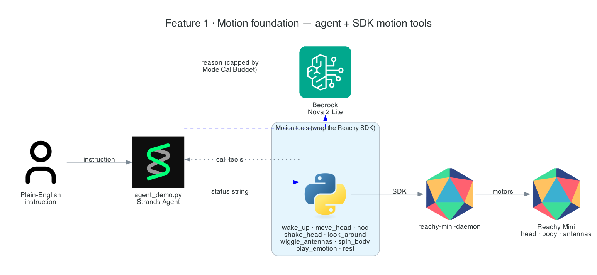

The original demo and the pattern everything else grew from: a Strands agent given
**motion tools that wrap the Reachy SDK**, deciding how to move the physical robot in
response to a plain-English instruction.

**Files:** `agent_demo.py`, launched by `run.sh`.

**Tools** — each is an ordinary Python function returning a short status string the
agent reads back:

| Tool | Behavior |
|------|----------|
| `wake_up()` | Enable motors, move to upright neutral. |
| `move_head(pitch, roll, yaw, duration=1.0)` | Orient the head in degrees (pitch ±40, roll ±40, yaw ±180). |
| `nod(times=2)` / `shake_head(times=2)` | Yes/no head gestures (capped 1–5). |
| `look_around()` | Sweep yaw +60 → −60 → center. |
| `wiggle_antennas(times=3)` | Both antennas up/down (capped 1–6). |
| `spin_body(degrees=90, duration=1.5)` | Rotate body about its vertical axis (±160). |
| `list_emotions()` / `play_emotion(name)` | List/play recorded animations from the HF emotion library. |
| `rest()` | Return to neutral — the agent is told to always finish here. |

**How it works:** the system prompt tells the agent to *express itself physically* and
chain several tools for a lively result. A `ModelCallBudget` Strands hook caps Bedrock
calls (`MAX_MODEL_CALLS`, default 15) to prevent runaway cost. The robot is **always
left in a safe neutral pose** in a `finally` block, even on error or Ctrl-C.

```bash
./run.sh                                        # default self-introduction routine
./run.sh "nod twice, wiggle your antennas, then spin around"
MEDIA_BACKEND=no_media ./run.sh                 # motion-only (skip camera/mic/speaker)
```

| Env | Default | Notes |
|-----|---------|-------|
| `AWS_REGION` | `us-east-1` | Bedrock region. |
| `BEDROCK_MODEL_ID` | `us.amazon.nova-2-lite-v1:0` | Bedrock model id. |
| `MEDIA_BACKEND` | `default` | `no_media` skips camera/mic/speaker. |
| `MAX_MODEL_CALLS` | `15` | Hard cap on model calls. |

## 2. Hardware bring-up & self-test (no LLM)

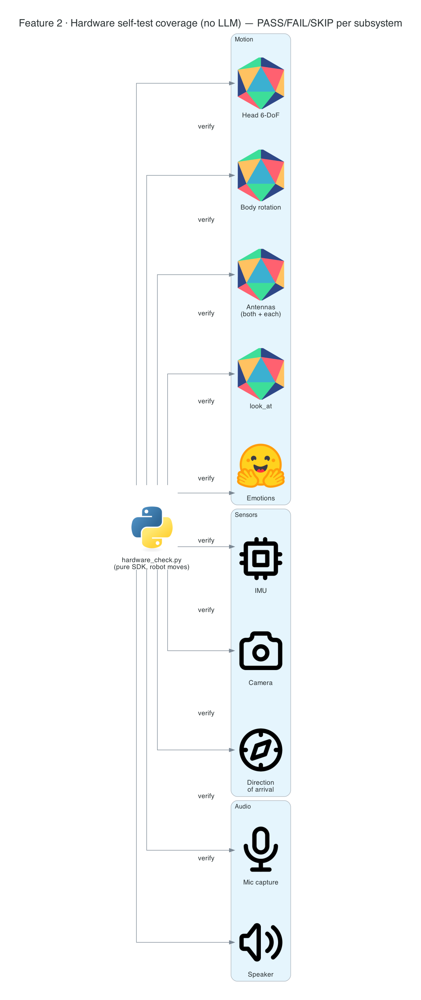

Pure-SDK scripts to verify the robot **independently of any agent or cloud** — the
first thing to run on a fresh build.

**Files:** `test_hardware.sh` → `hardware_check.py`, `verify_robot.sh` →
`verify_robot.py`, `mic_listen.sh`, `setup_reachy_udev.sh`.

- **`hardware_check.py`** — an end-to-end self-test of every feature with a
  **PASS/FAIL/SKIP** verdict each: head 6-DoF, body rotation, antennas (both + each
  individually), `look_at`, emotions, IMU, camera, mic, direction-of-arrival (DoA), and
  speaker. The robot physically moves.
- **`verify_robot.py`** — a quick connection + basic-motion sanity check.
- **`mic_listen.sh`** — a standalone live mic level meter (no venv) that flags when it
  hears you — useful for diagnosing the silent-mic gotcha.
- **`setup_reachy_udev.sh`** — `sudo bash setup_reachy_udev.sh` installs udev rules so
  the Reachy serial/audio/camera USB devices are accessible (0666) on every replug.

See [Host setup & hardware notes](#host-setup--hardware-notes) for one-time setup and
the silent-mic gotcha.

```bash
sudo bash setup_reachy_udev.sh   # one-time USB permissions
./test_hardware.sh               # full self-test (robot moves)
./mic_listen.sh                  # confirm the mic hears you
```

## 3. Offline voice wake-up

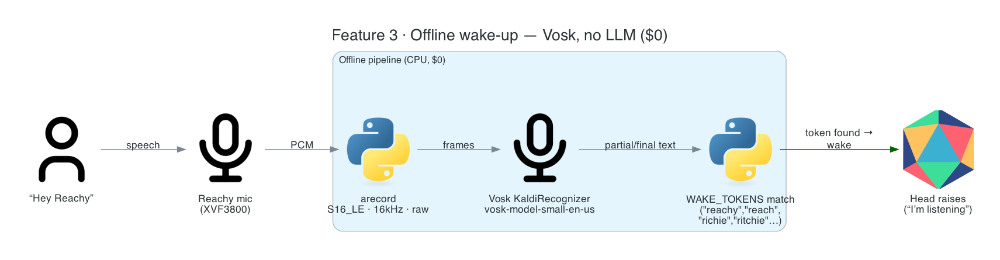

The "Hey Reachy" trigger, **fully offline, zero LLM** — the lowest layer of the voice
stack, demonstrable on its own.

**Files:** `voice_wake.py` / `voice_wake.sh`.

**How it works:** a [Vosk](https://alphacephei.com/vosk/) recognizer
(`vosk-model-small-en-us-0.15`, 16 kHz) runs on a raw `arecord` PCM stream. Because
"reachy" isn't in Vosk's English lexicon, the wake match looks for the homophone
renderings Vosk actually emits:

```python
WAKE_TOKENS = ("reachy", "reach", "richie", "ritchie", "reachie", "reaches")
```

Both partial and final transcripts are scanned for any token. `voice_wake.py` is the
standalone demo; the same logic is embedded in the full assistant (feature 5).

```bash
./voice_wake.sh    # downloads the Vosk model once, then listens for "Hey Reachy"
```

## 4. Local vision — Cosmos Reason 2

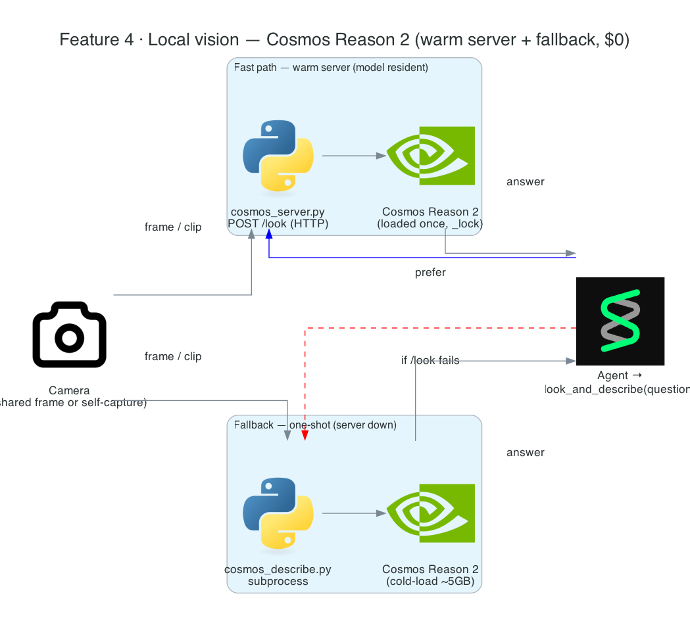

The robot's eyes: **NVIDIA Cosmos Reason 2** (a Qwen3-VL VLM) running locally on the
Thor GPU. Scene description and visual Q&A, **$0 per look**.

**Files:** `cosmos_describe.py` (CLI + shared inference code), `cosmos_server.py`
(warm server), `cosmos_describe.sh` (CUDA venv bootstrap).

- **`cosmos_describe.py`** — captures a clip (or a single frame) from the camera via
  V4L2 and runs Cosmos. The model-load / inference / question-framing helpers are
  importable so the CLI and the warm server share **one** code path.
- **`cosmos_server.py`** — loads the ~5GB model **once** and keeps it resident behind a
  localhost HTTP API, so `look_and_describe` gets near-interactive responses instead of
  paying a cold start every glance.

| Endpoint | Returns |
|----------|---------|
| `GET /health` | `200 {"ready": true}` once loaded (`503` before). |
| `POST /look` | `{"answer", "seconds", "mode"}` — body: `question`, `seconds`, `fps`, `max_new_tokens`, `image`, `image_b64`. |

A single `Lock` serializes inference (GPU + camera are single-tenant). When the
in-process **camera owner** (face tracking) is up, the assistant passes the latest
frame as `image_b64` so the server doesn't fight it for the camera. See
**[`docs/local-models.md`](docs/local-models.md)** for the loading/inference internals
and the Jetson `device_map` gotcha.

```bash
./cosmos_describe.sh --seconds 5 --question "What is the person doing?" --show-thinking
./test_cosmos_look.sh    # exercises the warm server's /look endpoint
```

## 5. Voice assistant orchestration

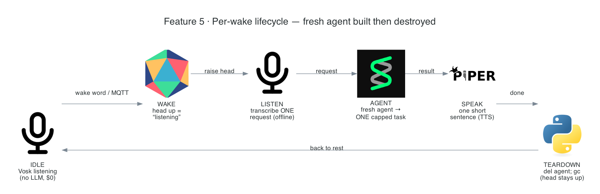

The centerpiece (`reachy_assistant.py`): **"Hey Reachy" → transcribe → fresh per-wake
Strands agent → speak**, tying every other feature together.

**Lifecycle (cost-minimal):**

1. **Idle** — only the offline Vosk listener runs. No agent, no LLM, **$0**.
2. **On wake** — the head raises ("I'm listening"); the request is transcribed offline
   (still $0).
3. **Task** — a **brand-new** Strands agent is built around the request, run under a
   hard model-call cap, picks a tool, and replies with one short spoken sentence.
4. **Tear-down** — the agent is `del`'d and garbage-collected; the head stays up; back
   to idle.

```python
agent = Agent(model=_build_model(), system_prompt=sys_prompt,
              tools=[look_and_describe, play_emotion, list_emotion_moves,
                     nod, shake_head, look_around, wiggle_antennas, spin_body, move_head,
                     list_iot_tables, get_table_schema, query_iot_data],
              hooks=[budget])
result = agent(request)
...
del agent; gc.collect()
```

The agent is given **twelve tools** and the system prompt steers it to
discover-before-guess and to always reply with **one short spoken sentence** (never
raw JSON):

| Tool | What it does |
|------|--------------|
| `look_and_describe(question="")` | Look through the camera and answer about the scene (Cosmos, $0). Prefers the warm server; falls back to a one-shot subprocess. |
| `play_emotion(name)` | Play ONE of ~80 pre-choreographed moves, chosen to match the mood. |
| `list_emotion_moves()` | List the valid move names (also injected into the prompt). |
| `nod(times=2)` / `shake_head(times=2)` | Yes/no head gestures (clamped 1–5), returning to neutral. |
| `look_around()` | Sweep the head left/right/center to scan the room. |
| `wiggle_antennas(times=3)` | Expressive antenna wiggle (clamped 1–6). |
| `spin_body(degrees=90)` | Rotate the body about its vertical axis (clamped ±160). |
| `move_head(pitch, roll, yaw)` | Absolute head orientation for a deliberate look/tilt (clamped pitch ±40, roll ±40, yaw ±180). |
| `list_iot_tables()` | Discover data-lake tables with row counts and last-ingestion times. |
| `get_table_schema(table)` | List a table's columns + sample values before filtering. |
| `query_iot_data(table, limit=20, where="")` | Query rows with an optional SQL WHERE clause. |

The six motion tools (promoted from `agent_demo.py`) let the agent **compose novel
gestures** — "nod twice, then look left" — beyond the canned `play_emotion` clips.
They're safe to call mid-task: the face tracker is paused while `_busy` is set, and
`handle_wake` recenters the head afterwards, so nothing else drives the motors.

**Speech out:** local TTS via Piper, falling back to `espeak-ng`, then print. After
each task a **summary** prints: backend/model, model calls vs. cap, tokens, estimated
cost ($0 local), LLM latency, vision time, and wall time.

```bash
./reachy_assistant.sh    # say "Hey Reachy"; Ctrl-C to stop
```

## 6. Local LLM brain (default)

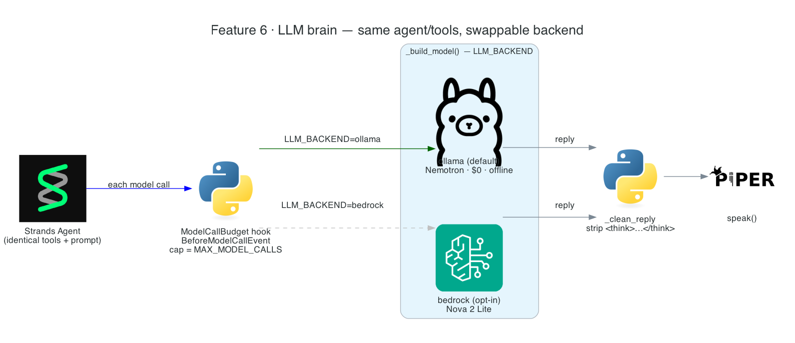

The agent's reasoning model defaults to **local Nemotron via Ollama** ($0, offline),
with **Amazon Bedrock Nova 2 Lite** as an opt-in swap — identical tools and prompt
either way.

**Files:** `reachy_assistant.py` (`_build_model`), `nemotron_setup.sh`.

```python
def _build_model():
    if LLM_BACKEND == "bedrock":
        return BedrockModel(model_id=MODEL_ID, region_name=AWS_REGION)
    from strands.models.ollama import OllamaModel
    return OllamaModel(host=OLLAMA_HOST, model_id=NEMOTRON_MODEL)
```

`nemotron_setup.sh` ensures Ollama is installed and serving, the model is pulled and
advertises the **`tools`** capability, and that it responds. Reasoning `<think>…</think>`
output is stripped before speaking. Full detail — model ids, the cost guard, and a
local-vs-Bedrock comparison — is on the
**[`docs/local-models.md`](docs/local-models.md)** page.

```bash
./reachy_assistant.sh                       # local Nemotron (default, $0)
LLM_BACKEND=bedrock ./reachy_assistant.sh   # Amazon Nova 2 Lite
```

## 7. IoT data-lake Q&A

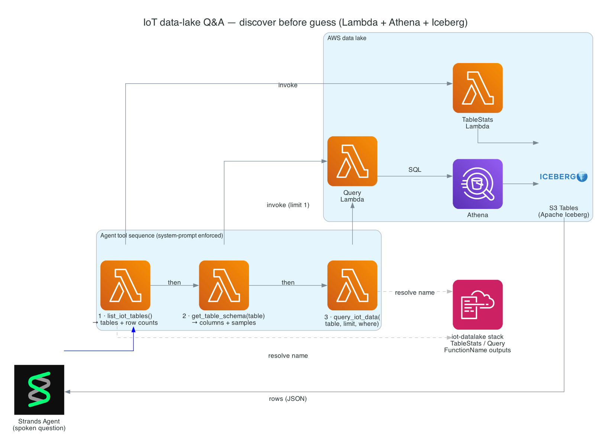

The agent can answer questions about **IoT sensor data** stored in an AWS data lake
(S3 Tables / Apache Iceberg), queried through Lambda + Athena.

**Files:** `reachy_assistant.py` (tools `list_iot_tables`, `get_table_schema`,
`query_iot_data`; helpers `_get_lambda_name`, `_invoke_lambda`).

**Discover-before-guess** — the system prompt enforces this three-step flow:

| Tool | Purpose |
|------|---------|
| `list_iot_tables()` | List tables with row counts + last-ingestion times. |
| `get_table_schema(table)` | Columns + sample values before filtering. |
| `query_iot_data(table, limit=20, where="")` | Query rows; optional SQL WHERE (values are strings — quote them). |

The tools resolve their Lambda **function names from the `iot-datalake` CloudFormation
stack outputs** (`TableStatsFunctionName`, `QueryFunctionName`), then invoke them via
the AWS CLI. Results come back as JSON, but the agent is required to answer with **one
plain spoken sentence** — never raw JSON or table dumps.

| Env | Default |
|-----|---------|
| `DATALAKE_STACK` | `iot-datalake` |
| `DATALAKE_REGION` | `us-east-1` |

> Example: *"Hey Reachy, has the kitchen water sensor tripped today?"* → the agent
> discovers the table, inspects its schema, queries with a WHERE clause, and speaks the
> answer.

## 8. AWS IoT Core MQTT trigger

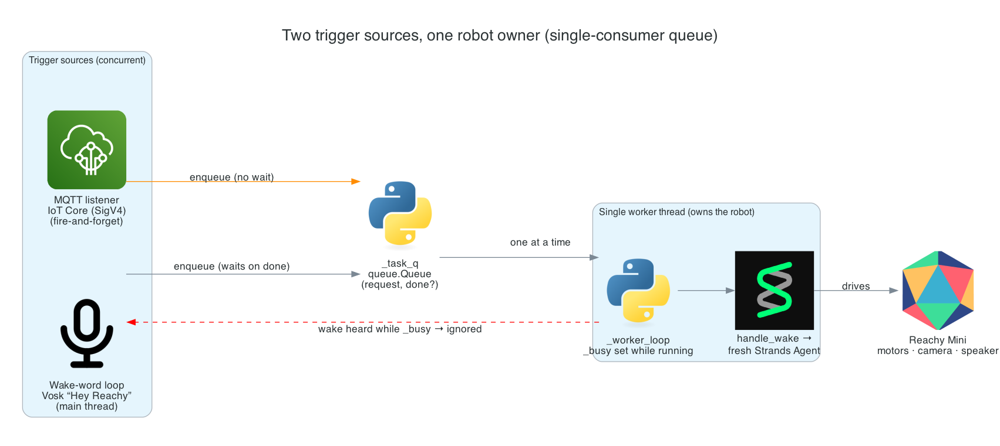

A **second wake source** alongside the voice wake word: an MQTT subscription that turns
incoming messages into agent tasks.

**Files:** `reachy_assistant.py` (`start_iot_listener`, `_build_iot_request`,
`_worker_loop`), `send_mqtt.sh`.

**How it works:** connects to AWS IoT Core over **WebSocket + SigV4** using the default
AWS credential chain — **no device certificates**. Disabled unless both `IOT_ENDPOINT`
and `IOT_TOPIC` are set, so the default behavior is voice-only and unchanged.

**Single robot owner:** both the wake-word loop and the MQTT listener enqueue onto one
queue, drained by a single worker thread, so the motors and agent are **never driven by
two sources at once**. A wake heard mid-task is ignored; the MQTT callback is
fire-and-forget so its keep-alive heartbeats never stall.

**Payload routing** (`_build_iot_request`):

| Payload | Routes to |
|---------|-----------|
| `{"event":"look","question":"…"}` | `look_and_describe` (camera vision) |
| `{"event":"move","instruction":"…"}` | Motion tools — compose a gesture (`nod`/`look_around`/`spin_body`/…); `gesture`/`motion` and `moves`/`action` are accepted too |
| `{"message":"<sentence>"}` | `play_emotion` matched to the sentiment |
| *(any other JSON / text)* | Generic — the agent decides how to react (may gesture, emote, look, or query) |

```bash
./send_mqtt.sh '{"event":"look","question":"is anyone at the door?"}'
./send_mqtt.sh '{"event":"move","instruction":"nod twice, then look around the room"}'
./send_mqtt.sh '{"message":"we just hit our sales target!"}'
./send_mqtt.sh '{"event":"water_leak","room":"kitchen"}'
```

| Env | Default |
|-----|---------|
| `IOT_TOPIC` | `the-project/reachy-mini/XIAOReachyMini/action` (unset → disabled) |
| `IOT_ENDPOINT` | auto-resolved via `aws iot describe-endpoint` |
| `IOT_REGION` | `us-east-1` |

## 9. Emotion moves

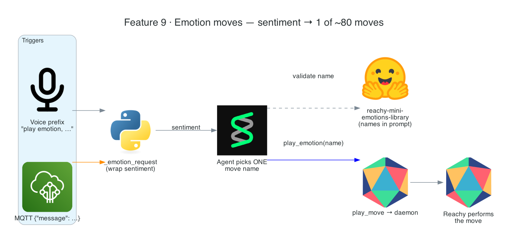

Expressive reactions: the agent plays **one of ~80 pre-choreographed moves** matched to
a request's or message's sentiment.

**Files:** `reachy_assistant.py` (`play_emotion`, `list_emotion_moves`, `_load_emotions`,
`_emotion_request`, `_route_voice_request`).

**How it works:** the recorded-move library
(`pollen-robotics/reachy-mini-emotions-library`) is loaded once at startup and its move
names are **injected into the system prompt**, so the agent picks a valid name in a
single shot (no extra discovery round-trip). `play_emotion` validates the name against
the list and replays it on the robot; an invalid name returns the valid set to retry.

**Two ways to trigger it:**

- **Voice prefix** — say the `EMOTION_PREFIX` (default `"play emotion"`) then a
  sentiment: *"play emotion, I am so happy"* routes the rest to `play_emotion`.
- **MQTT `message`** — `{"message":"great job team"}` is read for sentiment and acted
  out (e.g. praise → `success1`/`proud1`, bad news → `sad1`, greeting → `welcoming1`).

```bash
# voice:  "Hey Reachy ... play emotion, that's wonderful news"
./send_mqtt.sh '{"message":"that is wonderful news"}'
```

## 10. Idle presence watcher

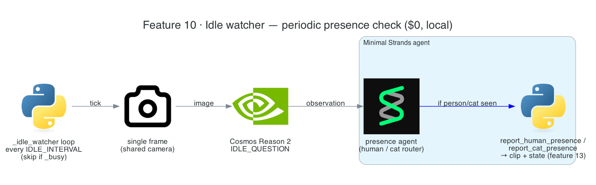

While resting, the robot **periodically notices who's around** — fully local, $0 — and
routes the observation through **species-specific Strands tools** (the hook for future
behaviors like greeting a person or reacting to a cat). The human/cat routing itself is
detailed in [feature 13](#13-presence-split--humans-vs-cats).

**Files:** `reachy_assistant.py` (`_idle_watcher`, `_run_presence_agent`,
`report_human_presence`, `report_cat_presence`).

**How it works:** every `IDLE_INTERVAL` seconds (default 10), it grabs a **single frame**
(from the shared camera buffer) and asks Cosmos `IDLE_QUESTION` (default: how many people
**and how many cats**, and what each is doing). The observation is handed to a **minimal
Strands agent** that routes to the matching presence tool(s). Ticks are **skipped while a
task is running**, so the watcher never competes with a real look or drives the GPU
mid-task.

| Env | Default |
|-----|---------|
| `IDLE_WATCH` | `1` (set `0` to disable) |
| `IDLE_INTERVAL` | `10` seconds |
| `IDLE_QUESTION` | "How many people and how many cats can you see? …" |

## 11. Face tracking

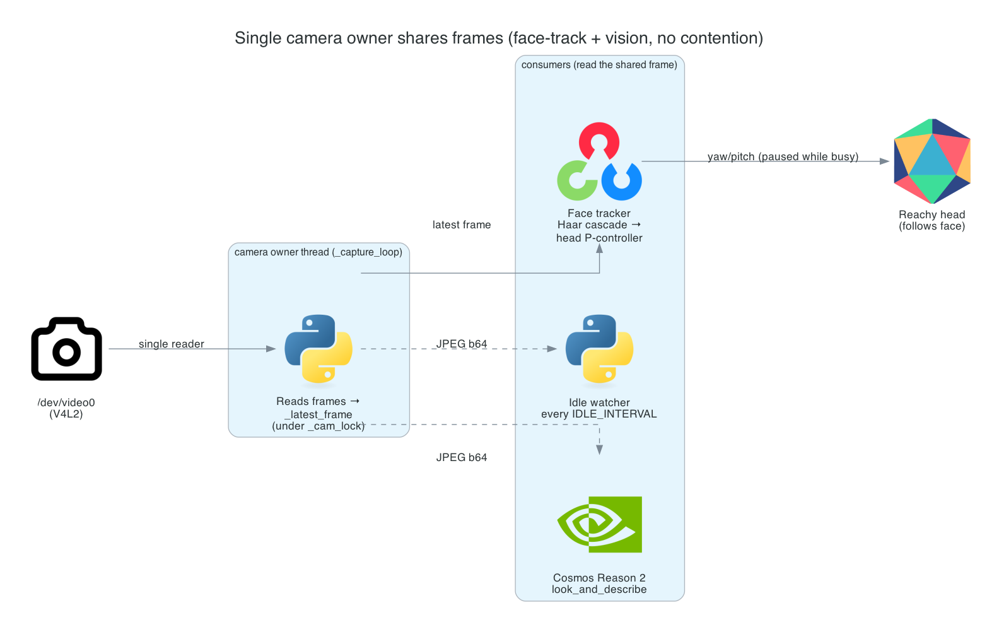

The robot's head **follows your face** in real time — local OpenCV, offline, $0 — and
runs concurrently with Cosmos vision.

**Files:** `reachy_assistant.py` (`_capture_loop`, `_tracker_loop`, `_latest_jpeg_b64`).

**How it works:** a **single camera-owner thread** (`_capture_loop`) is the only reader
of `/dev/video<CAMERA>` — it continuously publishes the latest frame. The tracker
(`_tracker_loop`) detects the largest (nearest) face with an OpenCV Haar cascade,
computes a horizontal/vertical error, and drives the head with a proportional controller
(deadband to kill jitter, clamped yaw/pitch). Crucially, the same owner **shares frames
with Cosmos** (passed as `image_b64`), so head-tracking and the idle/agent vision checks
coexist without V4L2 contention. Tracking pauses and recenters while a task owns the head.

When the [media bus](#16-cameramic-media-bus) is up (the default), `_capture_loop`
**subscribes to the camera broker** instead of opening `/dev/video0` itself, so the same
frames also reach other processes; with no broker it falls back to owning the device
directly (MJPG, ~30fps). The controller gains were retuned for snappier tracking
(`FACE_KP_YAW` 13.5→20, `FACE_KP_PITCH` 10.5→16, `FACE_MOVE_PERIOD` 0.2→0.1s,
`FACE_MOVE_DUR` 0.25→0.12s, `FACE_DEADBAND` 0.10→0.06) with a more sensitive Haar pass
(`1.1`, `4`, `minSize=30px`) — all env-overridable.

| Env | Default | Notes |
|-----|---------|-------|
| `FACE_TRACK` | `1` | `0` → Cosmos server self-captures instead. |
| `FACE_YAW_SIGN` / `FACE_PITCH_SIGN` | `-1` / `1` | Flip if the head moves the wrong way. |
| `FACE_KP_YAW` / `FACE_KP_PITCH` | `20` / `16` | Proportional gains (deg/step/unit error). |
| `FACE_MOVE_PERIOD` / `FACE_MOVE_DUR` | `0.1` / `0.12` | Head update rate (~10 Hz) and per-move smoothing (s). |
| `FACE_DEADBAND` | `0.06` | Ignore normalized errors smaller than this (anti-jitter). |

## 12. Validation suite

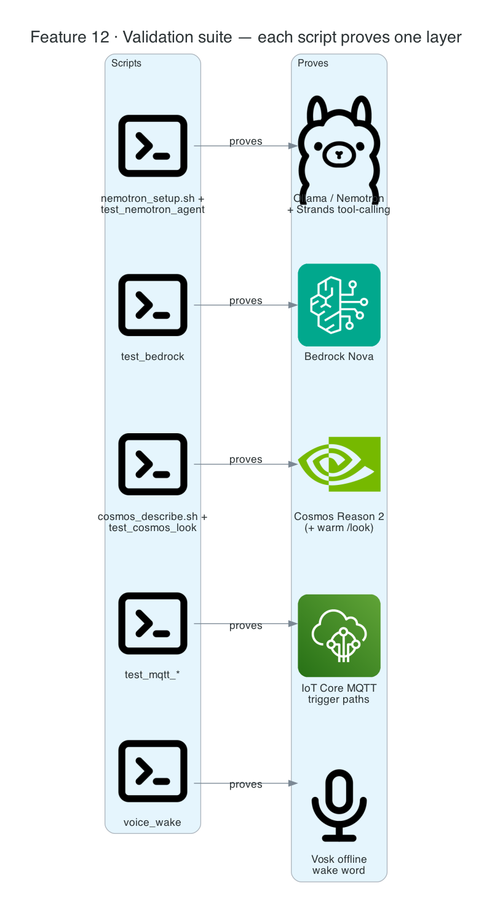

Every layer is **provable on its own** before it's wired into the assistant — so a
failure is isolated to one component.

| Script | Proves |
|--------|--------|
| `nemotron_setup.sh` | Ollama installed/serving, model pulled, advertises tool-calling, responds. |
| `test_nemotron_agent.sh` → `.py` | Strands + tool-calling work on local Nemotron (mirrors the real tool surface 1:1). |
| `test_bedrock.sh` → `.py` | Bedrock access + the Nova model work. |
| `cosmos_describe.sh` | Local Cosmos Reason 2 vision end to end. |
| `test_cosmos_look.sh` | The warm Cosmos server's `/look` endpoint. |
| `test_mqtt_look.sh` / `test_mqtt_move.sh` / `test_mqtt_welcome.sh` / `test_mqtt_success.sh` / `test_mqtt_sad.sh` | Each MQTT trigger path (vision / motion / greeting / praise / bad-news). |
| `voice_wake.sh` → `.py` | Offline "Hey Reachy" wake-up (no LLM). |

## 13. Presence split — humans vs cats

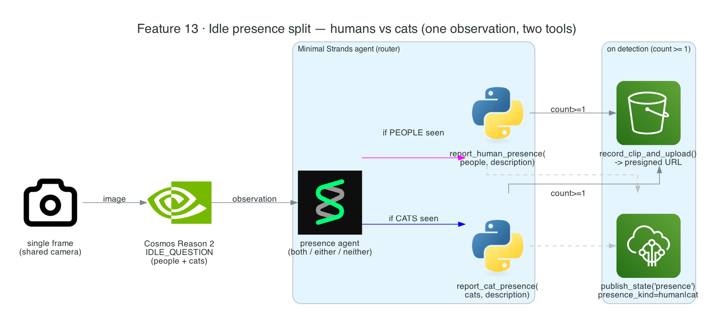

The idle observation is routed to **two species-specific tools** instead of one generic
`report_presence`, so humans and cats can trigger **different** behaviors. Both can fire
from a single observation (a person *and* a cat in frame), either alone, or neither.

**Files:** `reachy_assistant.py` (`report_human_presence`, `report_cat_presence`,
`_run_presence_agent`).

**How it works:** the minimal presence agent (from [feature 10](#10-idle-presence-watcher))
is given **both** tools and a system prompt that says: call `report_human_presence` if one
or more **people** are present, `report_cat_presence` if one or more **cats** are present,
**both** tools if both are present, and nothing otherwise. Each tool currently **logs** the
sighting (the hook for future per-species actions), and — only when its count is ≥ 1 —
records a short clip ([feature 15](#15-interaction-clip-recording--s3)) and publishes a
`presence` state message ([feature 14](#14-robot-state-telemetry-to-iot-core)) tagged with
`presence_kind` (`human`/`cat`), `presence_count`, and `presence_description`.

```python
@tool
def report_human_presence(people: int, description: str) -> str:
    """Report that one or more PEOPLE (humans) are currently visible to the robot."""
    print(f"[human-presence] people={people} :: {description}")
    if people >= 1:                                  # only upload on a real detection
        video_url = record_clip_and_upload()
        publish_state("presence", presence_kind="human", presence_count=people,
                      presence_description=description,
                      **({"video_url": video_url} if video_url else {}))
    return "logged"
```

`report_cat_presence` is identical with `presence_kind="cat"`. Both the clip upload and
the state publish are no-ops when S3/MQTT (or the camera owner) are unavailable, so the
split works the same in a fully local run — it just logs.

## 14. Robot-state telemetry to IoT Core

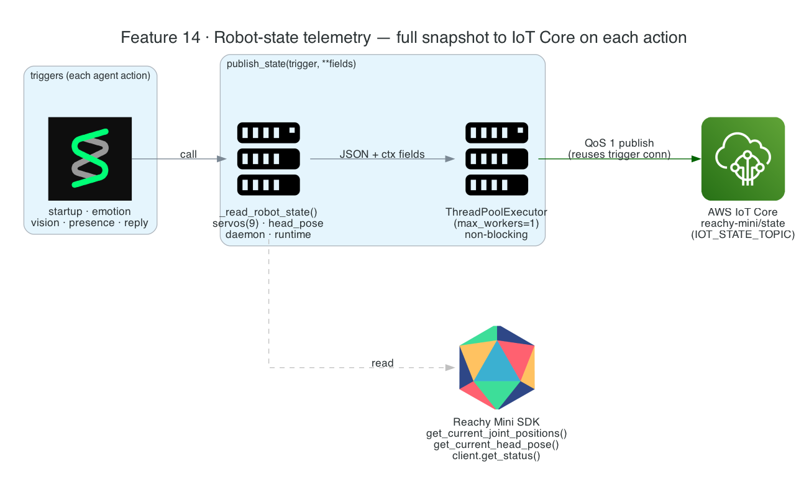

Every agent action **uploads a full snapshot of the robot's state** to AWS IoT Core, so an
external system (dashboard, data lake, another robot) can follow exactly what Reachy is
doing in near-real-time. It **reuses the same MQTT connection** the trigger
([feature 8](#8-aws-iot-core-mqtt-trigger)) already holds — no second client, no certs.

**Files:** `reachy_assistant.py` (`publish_state`, `_read_robot_state`,
`set_iot_connection`, `_do_publish`).

**How it works:** `publish_state(trigger, **fields)` snapshots the robot via
`_read_robot_state()` and submits the JSON to a **single-worker `ThreadPoolExecutor`** so
publishing is **non-blocking** and never stalls a task (or the MQTT keep-alive). It fires on
these triggers:

| `trigger` | Fired from | Extra fields |
|-----------|------------|--------------|
| `startup` | on connect | — |
| `emotion` | `play_emotion` | `emotion_name` |
| `motion` | any direct motion tool ([feature 18](#18-direct-motion-tools)) | `motion`, plus per-tool params (`times`/`degrees`/`pitch`…) |
| `vision` | `look_and_describe` | `vision_question`, `vision_answer` |
| `presence` | human/cat presence tools | `presence_kind`, `presence_count`, `presence_description`, `video_url?` |
| `reply` | end of each wake interaction | `request`, `reply`, `video_url?` |

`_read_robot_state()` captures **every value the Reachy Mini Lite SDK exposes**, each
section guarded so one unavailable reading never drops the message (IMU is omitted — it is
wireless-only and always `null` on the Lite):

| Section | Contents |
|---------|----------|
| `servos` | 9 joint positions (rad): `body_rotation`, `stewart_1..6`, `right_antenna`, `left_antenna` |
| `head_pose` | `position` (xyz) + `rpy` (roll/pitch/yaw, from the pose matrix) |
| `daemon` | `robot_name`, `version`, `hardware_id`, `wireless_version`, `no_media`, `media_released`, `camera_specs_name`, `wlan_ip`, `error`, `backend_ready`, `backend_last_alive` |
| `runtime` | `is_recording`, `connection_mode`, `busy`, `llm_backend` |

Example message published to `the-project/reachy-mini/XIAOReachyMini/state` (QoS 1):

```json
{
  "device": "reachy-mini-12345", "ts": 1750972800, "trigger": "reply",
  "servos": {"body_rotation": 0.01, "stewart_1": -0.12, "right_antenna": 0.0, "left_antenna": 0.0},
  "head_pose": {"position": [0.0, 0.0, 0.18], "rpy": [0.0, 0.05, -0.31]},
  "daemon": {"robot_name": "reachy-mini", "version": "1.x", "backend_ready": true},
  "runtime": {"is_recording": false, "connection_mode": "localhost_only", "busy": true, "llm_backend": "ollama"},
  "request": "who is here?", "reply": "I can see one person at the desk.",
  "video_url": "https://reachy-mini-<your-aws-account-id>.s3.amazonaws.com/videos/reachy_20250626_2230.mp4?..."
}
```

Publishing is enabled automatically whenever the MQTT trigger is up (it's the same
connection); set the topic with `IOT_STATE_TOPIC` (defaults to `the-project/reachy-mini/XIAOReachyMini/state`). With
no MQTT configured, `publish_state` is a no-op and a voice-only run is unaffected.

## 15. Interaction clip recording → S3

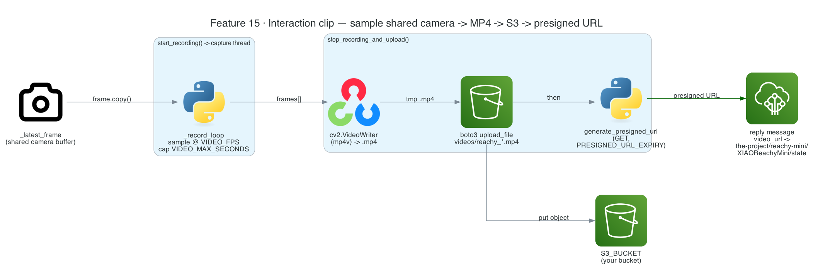

Each wake interaction (and each presence detection) is **recorded to a short MP4, uploaded
to S3**, and a **presigned download URL** is attached to the reply / presence message — so
whoever receives the MQTT event can watch exactly what the robot saw.

**Files:** `reachy_assistant.py` (`start_recording`, `stop_recording`,
`stop_recording_and_upload`, `record_clip_and_upload`, `_encode_and_upload`).

**How it works:** crucially, it **samples the shared camera buffer** (`_latest_frame`) the
[media bus](#16-cameramic-media-bus) / camera owner already publishes — a second
`VideoCapture` would collide with the single device owner. Two entry points:

- **Interaction clips** — `start_recording()` spins a capture thread when `handle_wake`
  begins; it samples `_latest_frame` at `VIDEO_FPS` (default 15) up to a `VIDEO_MAX_SECONDS`
  (default 120s) memory cap. At the end, `stop_recording_and_upload()` encodes and returns
  the URL, which rides along on the `reply` state message.
- **Event clips** — `record_clip_and_upload(seconds)` grabs a fixed `VIDEO_CLIP_SECONDS`
  (default 30) clip *now*, used by the presence tools for instantaneous events.

Encoding uses `cv2.VideoWriter` with the `mp4v` codec (no extra `imageio` dependency); the
file is uploaded with plain `boto3.client("s3").upload_file()` to `S3_BUCKET`
(`videos/reachy_<timestamp>.mp4`), then `generate_presigned_url("get_object", …)` returns a
time-limited GET link (`PRESIGNED_URL_EXPIRY`, default 1h). The whole path is wrapped so
**any encode/upload failure is swallowed** — video must never break an interaction — and is
a **no-op** when the camera owner or MQTT is off.

| Env | Default | Notes |
|-----|---------|-------|
| `S3_BUCKET` | _(unset)_ | Destination bucket for clips. **Required** — clip upload is skipped while this is unset. |
| `VIDEO_FPS` | `15` | Sampling/encode frame rate. |
| `VIDEO_MAX_SECONDS` | `120` | Memory cap on an interaction recording. |
| `VIDEO_CLIP_SECONDS` | `30` | Length of a one-shot event clip (presence). |
| `PRESIGNED_URL_EXPIRY` | `3600` | Presigned URL validity (seconds). |

## 16. Camera/mic media bus

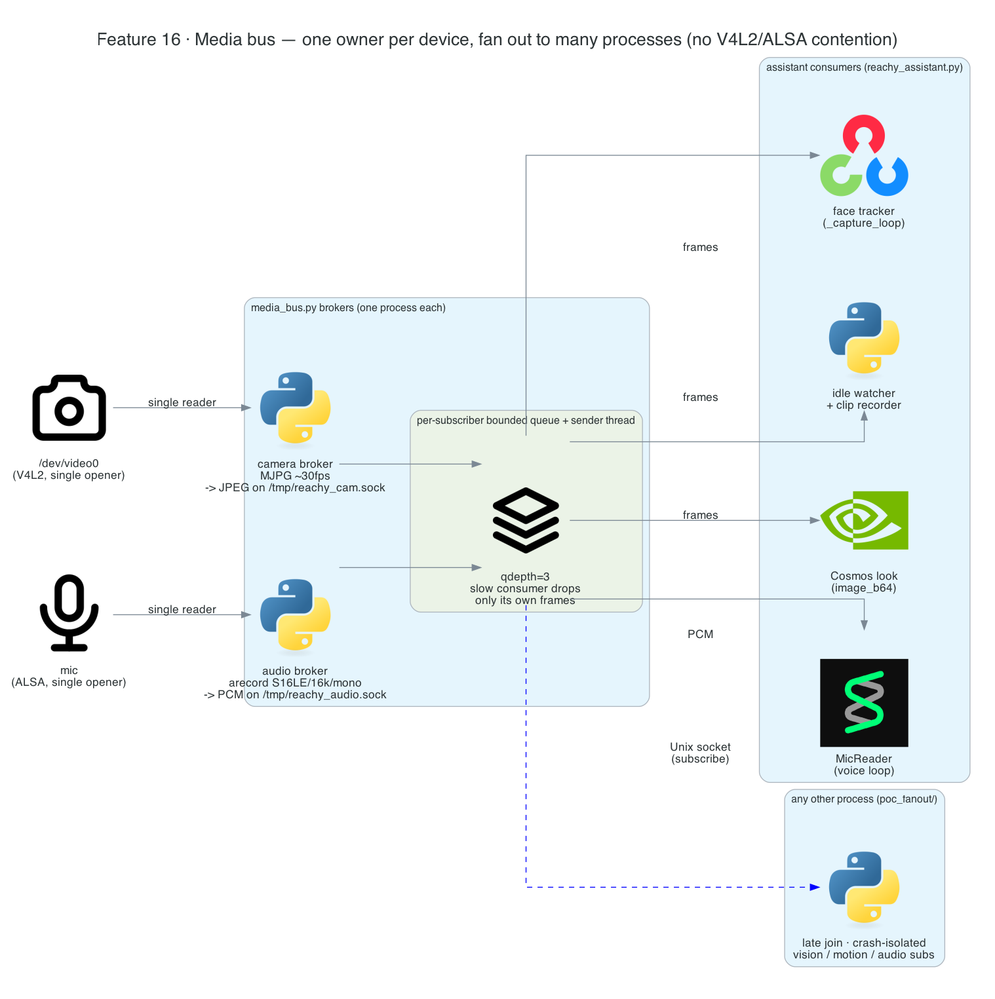

`/dev/video0` (V4L2) and the ALSA mic are **single-opener** devices — only one process can
hold each. The media bus makes **one broker own each device** and republishes the live
stream over a **Unix domain socket**, so any number of independent processes — the
assistant's own face tracker, idle watcher and clip recorder, the voice loop, *and brand-new
tools you add later* — can each consume the same camera frames and mic audio at once.

**Files:** `media_bus.py` (the brokers + client API), `poc_fanout/` (a standalone proof),
and the wiring in `reachy_assistant.py` / `reachy_assistant.sh`.

**Run the brokers** (started automatically by `reachy_assistant.sh` when `MEDIA_BUS=1`):

```bash
python media_bus.py camera   # owns /dev/video0, publishes JPEG frames
python media_bus.py audio    # owns the mic,      publishes S16LE/16k/mono PCM
```

**Client API** used by the assistant and any subscriber:

```python
import media_bus
media_bus.broker_available("camera")        # is the camera broker up?
for frame in media_bus.camera_frames():     # decoded BGR numpy frames
    ...
mic = media_bus.MicReader()                 # drop-in for an arecord Popen (.stdout.read(n), .terminate())
```

**How it works:**

- **MJPG capture is essential.** The camera broker forces the `MJPG` FOURCC: OpenCV's
  default `YUYV` is hard-capped near **5 fps** on this camera, while MJPG gives **~30+**. It
  captures at 1920×1080, publishes a resized 640×480 JPEG (`REACHY_CAM_Q` quality).
- **Wire format** is `[4-byte length][payload]`, where `payload = [seq u64][ts f64][body]`
  — a JPEG frame for camera, a 100 ms PCM chunk for audio.
- **Per-subscriber backpressure isolation.** Each subscriber gets its **own bounded queue**
  (`qdepth=3`) drained by a dedicated sender thread. When a consumer is slow, the broker
  drops **that subscriber's** oldest frame (`get_nowait` + `put_nowait`) and moves on — it
  never stalls the device read loop or the other subscribers. A crashed consumer just closes
  its socket and is dropped; survivors see **0 drops**.
- **Drop-in mic.** `MicReader` exposes `.stdout.read(n)` / `.terminate()` / `.wait()` /
  `.kill()`, so the voice loop's existing "terminate + re-open to drop task-time backlog"
  pattern still works — a fresh `MicReader` starts from live audio.
- **Backward-compatible fallback.** If no broker is running, `_capture_loop` opens
  `/dev/video0` directly (still MJPG) and `_start_mic()` spawns `arecord` — so a standalone
  run with `MEDIA_BUS=0` behaves exactly as before.

**Proof — `poc_fanout/`.** `run_proof.py` is a self-contained demonstration: one camera +
one mic feeding the **real Cosmos vision workload** plus several other processes
concurrently, including a **mid-stream late join** and a **deliberately crashed consumer**,
with **0 drops on the survivors**. See [`poc_fanout/README.md`](poc_fanout/README.md).

| Env | Default | Notes |
|-----|---------|-------|
| `MEDIA_BUS` | `1` | `reachy_assistant.sh` starts both brokers; `0` → assistant owns the devices in-process. |
| `REACHY_CAM_SOCK` / `REACHY_AUD_SOCK` | `/tmp/reachy_cam.sock` / `/tmp/reachy_audio.sock` | Broker socket paths. |
| `REACHY_CAM_W` / `REACHY_CAM_H` | `640` / `480` | Published frame size (captures at 1920×1080). |
| `REACHY_CAM_FPS` / `REACHY_CAM_Q` | `30` / `70` | Publish rate and JPEG quality. |
| `REACHY_AUD_MS` | `100` | PCM chunk size (ms). |

## 17. Conversational memory

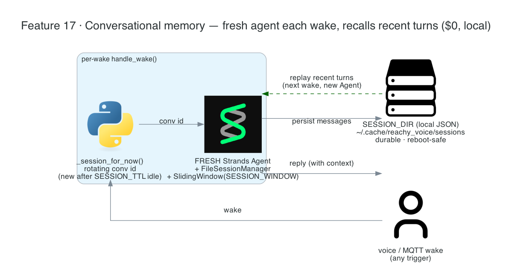

The robot **remembers recent turns across wakes** — ask a follow-up like *"…and what was
the first thing I said?"* and the fresh per-wake agent recalls it — yet idle stays **$0**
and the memory survives a **reboot**. Built entirely on Strands' built-in session managers,
storing messages as **local JSON** (no cloud, no DB).

**Files:** `reachy_assistant.py` (`_session_for_now`, `_touch_interaction`, the
`handle_wake` agent build), `poc_session_memory/` (isolated PoC + 10/10 proof).

**How it works:** every wake still builds a **brand-new agent** (the cost-minimal lifecycle
is unchanged), but all wakes — voice *and* MQTT — share **one rotating conversation id**, so
each fresh agent reloads the prior turns:

- `_session_for_now()` returns the active conversation id, **rotating to a new one after
  `SESSION_TTL` seconds of inactivity** (the gap is measured end-of-task → next wake via
  `_touch_interaction()`), so a long pause naturally starts a "new conversation".
- The agent is built with a **`FileSessionManager(session_id, storage_dir=SESSION_DIR)`** —
  which persists every message to JSON under `SESSION_DIR` — and a
  **`SlidingWindowConversationManager(window_size=SESSION_WINDOW)`**, which bounds how many
  recent messages are replayed into context (capping cost/latency; older turns drop off).
- `SESSION_MEMORY=0` skips both managers, restoring the **old stateless** per-wake behavior.

```python
session_id = _session_for_now()                 # None when SESSION_MEMORY=0 → stateless
if session_id is not None:
    agent_kwargs.update(
        agent_id="reachy",
        session_manager=FileSessionManager(session_id=session_id, storage_dir=SESSION_DIR),
        conversation_manager=SlidingWindowConversationManager(window_size=SESSION_WINDOW),
    )
agent = Agent(**agent_kwargs)
```

**Proof — `poc_session_memory/`.** `run_proof.sh` runs a **10/10 proof** on the *real*
Nemotron model: recall across agent teardown, **cross-process restart** (reboot-safe),
session isolation, pronoun/anaphora chains, fact-update overwrite, distractor robustness,
**tool + memory coexistence**, recall of a **tool result** without re-calling it,
sliding-window bound, and a long-horizon soak. See
[`poc_session_memory/README.md`](poc_session_memory/README.md).

| Env | Default | Notes |
|-----|---------|-------|
| `SESSION_MEMORY` | `1` | `0` → stateless per wake (old behavior). |
| `SESSION_DIR` | `~/.cache/reachy_voice/sessions` | Durable on-disk JSON session store. |
| `SESSION_TTL` | `300` | Idle gap (s) after which the conversation id rotates. |
| `SESSION_WINDOW` | `40` | Max messages replayed into context per wake. |

## 18. Direct motion tools

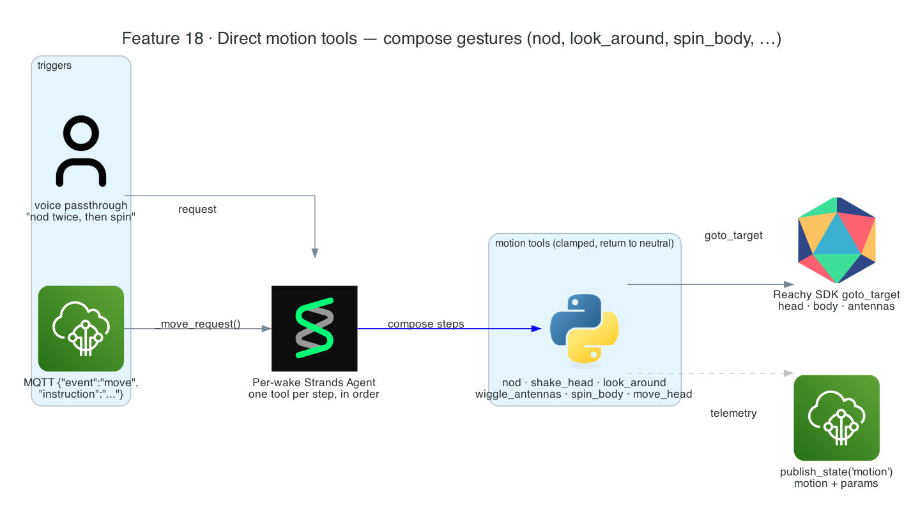

Beyond the ~80 canned `play_emotion` clips ([feature 9](#9-emotion-moves)), the agent has
**six primitive motion tools** it can **compose into novel gestures** — *"nod twice, then
look left, then spin"* — driving the head, body, and antennas directly.

**Files:** `reachy_assistant.py` (`nod`, `shake_head`, `look_around`, `wiggle_antennas`,
`spin_body`, `move_head`, `_move_request`), `test_mqtt_move.sh`. Promoted from the original
`agent_demo.py`.

**The six tools** (each clamps its inputs, returns to neutral where sensible, and publishes a
`motion` state snapshot — [feature 14](#14-robot-state-telemetry-to-iot-core)):

| Tool | Action | Clamp |
|------|--------|-------|
| `nod(times=2)` | Yes — pitch up/down, back to neutral | 1–5 |
| `shake_head(times=2)` | No — yaw left/right, back to neutral | 1–5 |
| `look_around()` | Sweep yaw left → right → center | — |
| `wiggle_antennas(times=3)` | Expressive antenna wiggle | 1–6 |
| `spin_body(degrees=90)` | Rotate body about its vertical axis | ±160° |
| `move_head(pitch, roll, yaw)` | Absolute head orientation (deliberate look/tilt) | pitch/roll ±40°, yaw ±180° |

**How it works:** the tools are first-class on **both triggers** — a spoken request passes
straight through to the agent, and an MQTT `{"event":"move","instruction":"…"}` message is
wrapped by `_move_request()` into an instruction to **perform every step in order, one tool
per step** (the keys `gesture`/`motion` and `instruction`/`moves`/`action` are all accepted).
They are **safe to call mid-task**: the face tracker is paused while `_busy` is set, and
`handle_wake` recenters the head afterward, so nothing else fights for the motors.

```bash
# MQTT: compose a multi-step gesture
./send_mqtt.sh '{"event":"move","instruction":"nod twice, then look around the room"}'
# Voice: "Hey Reachy … shake your head no, then wiggle your antennas"
```

# Reference

## Configuration (env vars)

Set on `reachy_assistant.sh`; sensible defaults shown.

| Variable | Default | Notes |
|----------|---------|-------|
| `LLM_BACKEND` | `ollama` | `ollama` (local Nemotron, $0) or `bedrock` (Amazon Nova). Same tools/prompt either way. |
| `NEMOTRON_MODEL` | `nemotron-3-nano:30b` | Ollama model id for the agent brain. |
| `OLLAMA_HOST` | `http://localhost:11434` | Ollama endpoint. |
| `BEDROCK_MODEL_ID` | `us.amazon.nova-2-lite-v1:0` | Bedrock inference-profile id (used when `LLM_BACKEND=bedrock`). |
| `AWS_REGION` | `us-east-1` | Region for Bedrock. |
| `MAX_MODEL_CALLS` | `12` | Hard cap on model calls per wake — aborts runaway loops (a datalake Q needs discover→schema→query→answer). |
| `LOOK_SECONDS` | `4` | Clip length for a vision look. |
| `LISTEN_SECONDS` | `8` | Max window to capture a spoken request. |
| `COSMOS_PORT` | `8077` | Warm Cosmos server port. |
| `COSMOS_MODEL` | `nvidia/Cosmos-Reason2-2B` | Local VLM. |
| `IDLE_WATCH` | `1` | Idle presence watcher on/off. |
| `IDLE_INTERVAL` | `10` | Seconds between idle presence checks. |
| `FACE_TRACK` | `1` | In-process camera owner + head-follow on/off. |
| `IOT_TOPIC` | `the-project/reachy-mini/XIAOReachyMini/action` | MQTT topic; unset → MQTT trigger disabled (voice-only). |
| `IOT_ENDPOINT` | *(auto)* | Resolved via `aws iot describe-endpoint` when empty. |
| `IOT_STATE_TOPIC` | `the-project/reachy-mini/XIAOReachyMini/state` | Topic for the robot-state telemetry upload ([feature 14](#14-robot-state-telemetry-to-iot-core)). |
| `DATALAKE_STACK` | `iot-datalake` | CloudFormation stack exporting the Lambda names. |
| `S3_BUCKET` | _(unset)_ | Bucket for interaction clips ([feature 15](#15-interaction-clip-recording--s3)). **Required** for upload. |
| `VIDEO_FPS` / `VIDEO_MAX_SECONDS` / `VIDEO_CLIP_SECONDS` | `15` / `120` / `30` | Clip sample rate, interaction memory cap, one-shot event-clip length (s). |
| `PRESIGNED_URL_EXPIRY` | `3600` | Presigned download-URL validity (s). |
| `MEDIA_BUS` | `1` | Start the camera/mic broker fan-out ([feature 16](#16-cameramic-media-bus)); `0` → in-process device ownership. |
| `REACHY_CAM_SOCK` / `REACHY_AUD_SOCK` | `/tmp/reachy_cam.sock` / `/tmp/reachy_audio.sock` | Media-bus socket paths. |
| `EMOTION_PREFIX` | `play emotion` | Spoken prefix that routes the rest of the sentence to `play_emotion`. |
| `SESSION_MEMORY` | `1` | Conversational memory across wakes (Strands `FileSessionManager`, local JSON, $0). `0` → stateless per wake (old behaviour). |
| `SESSION_DIR` | `~/.cache/reachy_voice/sessions` | Durable on-disk session store. |
| `SESSION_TTL` | `300` | Idle gap (s) after which the conversation id rotates (a fresh "new conversation"). |
| `SESSION_WINDOW` | `40` | Max messages replayed into context per wake (`SlidingWindowConversationManager`). |
| `VERBOSE` | `1` | Granular timestamped trace logging. |

Bedrock cost readout (per wake) uses `PRICE_IN_PER_M` / `PRICE_OUT_PER_M`; local
Nemotron runs report `$0`.

## Architecture details

- **Cost-minimal lifecycle.** Idle runs only the offline Vosk listener — zero LLM
  cost. The agent exists only between wake and reply, then is `del`'d and GC'd.
- **Conversational memory across wakes.** Each wake's messages persist to local
  JSON (Strands `FileSessionManager`), so the next fresh per-wake agent recalls
  recent turns ("…and what about yesterday?"). A `SlidingWindowConversationManager`
  bounds replayed context; the conversation id rotates after `SESSION_TTL` idle.
  Still $0 idle (just message storage — no LLM until wake) and reboot-safe via the
  durable `SESSION_DIR`. Verified on the local Nemotron model in `poc_session_memory/`.
- **Single robot owner.** Voice and MQTT both enqueue to one queue; a single worker
  thread runs tasks one at a time so two sources never drive the motors at once. A
  wake heard mid-task is ignored.
- **Concurrent local loops.** A single camera-owner thread reads frames and shares
  them with the face tracker, the idle watcher, and Cosmos — so head-tracking and
  vision run together without V4L2 contention. These pause while a task owns the head.
- **One owner per device, fan out to many.** The media bus ([feature 16](#16-cameramic-media-bus))
  brokers `/dev/video0` and the mic once and republish over Unix sockets, with
  **per-subscriber bounded queues** so a slow/crashed consumer drops only its own
  frames. Backward-compatible: with no broker, the assistant owns the devices directly.
- **Non-blocking cloud side-effects.** Telemetry ([feature 14](#14-robot-state-telemetry-to-iot-core))
  publishes on a single-worker thread pool, and clip upload ([feature 15](#15-interaction-clip-recording--s3))
  samples the *shared* camera buffer — both swallow all errors and no-op when MQTT/S3
  are off, so they can never break or slow an interaction.
- **Hard model-call cap.** `ModelCallBudget` (a Strands hook) counts `BeforeModelCallEvent`
  and raises once `MAX_MODEL_CALLS` is exceeded, bounding cost/latency per wake.
- **Reasoning-model hygiene.** `<think>…</think>` blocks a reasoning model emits are
  stripped before speaking.
- **Graceful degradation.** No Cosmos server → one-shot subprocess look. No Piper →
  `espeak-ng` → print. No IoT config → voice-only. No GPU → vision aborts clearly.

## Host setup & hardware notes

### One-time host setup (Linux/Jetson)

1. **USB permissions:** `sudo bash setup_reachy_udev.sh`
2. **GStreamer webrtc plugin** (needed for SDK media — camera/mic/speaker): not in apt; build once from
   [`gst-plugins-rs`](https://gitlab.freedesktop.org/gstreamer/gst-plugins-rs) per
   [Pollen's GStreamer guide](https://huggingface.co/docs/reachy_mini/SDK/gstreamer-installation)
   into `~/.local/gst-plugins-rs`; the scripts export `GST_PLUGIN_PATH` to it.
3. Power supply on (motors), and the robot connected via USB.

### Known gotcha — silent microphone (all-zero capture)

If the mic returns digital silence (and DoA is frozen) while the XVF3800 control plane is healthy,
it's [pollen-robotics/reachy_mini#845](https://github.com/pollen-robotics/reachy_mini/issues/845):
most often the **mic ribbon cable is installed upside-down** — reseat it with the **blue side /
"Main Board" text facing up**. Secondary fix: flash firmware v2.1.3 (bundled in the SDK at
`reachy_mini/assets/firmware/`). Use `mic_listen.sh` to confirm the fix.

## Project structure

| File | Purpose |
|------|---------|
| `reachy_assistant.sh` / `reachy_assistant.py` | **Main entry point** — the voice + MQTT assistant, the per-wake Strands agent, all twelve tools, face tracking, the idle watcher, conversational memory, state telemetry, and clip recording. |
| `media_bus.py` | Camera/mic brokers (one owner per device) + subscriber client API ([feature 16](#16-cameramic-media-bus)). |
| `poc_fanout/` | Standalone proof of the media-bus fan-out (`run_proof.py`): one camera + mic feeding Cosmos plus several processes, with late-join and crash isolation. |
| `poc_session_memory/` | Standalone PoC + 10/10 proof of conversational memory ([feature 17](#17-conversational-memory)) on the real Nemotron model. |
| `cosmos_server.py` | Warm Cosmos Reason 2 HTTP server (model loaded once). |
| `cosmos_describe.sh` / `cosmos_describe.py` | Local Cosmos vision: CLI + the shared model-load/inference code path. |
| `nemotron_setup.sh` | Install/serve Ollama + the Nemotron model; smoke test. |
| `agent_demo.py` | Minimal first motion demo (head/body/antenna/emotion tools) — the foundation the assistant grew from. |
| `send_mqtt.sh` | Publish a test MQTT message to the IoT topic. |
| `hardware_check.py` / `verify_robot.py` | Hardware self-tests (no LLM). |
| `voice_wake.py` | Offline wake-word demo. |
| `diagrams/*.py` | mingrammer sources for every diagram in this README (see below). |

## Diagrams

Every image in this README is generated programmatically with
[mingrammer `diagrams`](https://diagrams.mingrammer.com/) (requires Graphviz). Brand
icons that have no accurate built-in node (NVIDIA, Ollama, Strands, Reachy/Pollen,
OpenCV, Hugging Face, Piper, Apache Iceberg) are embedded from real logos in
`diagrams/icons/`; AWS services use the official `diagrams.aws.*` nodes.

There are three **high-level** diagrams (system architecture, agent message flow,
local model stack) plus a **per-feature sub-architecture** diagram for each of the
eighteen features — each showing only the subset of components that feature uses.

```bash
# render everything (each script writes its own docs/*.png)
for f in diagrams/*.py; do [ "$(basename "$f")" = "_icons.py" ] || python3 "$f"; done

# …or render one, e.g.:
python3 diagrams/system_architecture.py   # -> docs/system_architecture.png
python3 diagrams/cosmos_vision.py         # -> docs/cosmos_vision.png   (feature 4)
```

## Further reading

- **[Local models](docs/local-models.md)** — detailed breakdown of the on-device AI
  stack (Nemotron, Cosmos Reason 2, Vosk, Piper).
